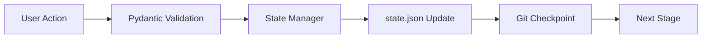

# ADR-001: State Management Architecture

**Status:** Accepted
**Date:** 2025-08-07
**Deciders:** VeriFlowCC Architecture Team

## Context

VeriFlowCC requires robust state management to support the Agile V-Model workflow with pause-resume capabilities. The system must track:
- Current stage in the V-Model pipeline
- Gate pass/fail status
- Sprint and session information
- Checkpoints for rollback
- Artifacts produced at each stage
- Decision history

We are integrating patterns from Agent-OS, which uses a `.vv/state.json` file for finite state machine tracking. We need to decide how to combine this with our existing Pydantic-based schema validation approach.

## Decision

We will implement a **hybrid state management architecture** that combines:
1. **Agent-OS's `.vv/state.json`** for workflow state persistence
2. **Pydantic models** for data validation and type safety
3. **Git-based checkpointing** for rollback capabilities

### Architecture Overview

```python
# State persistence layer (JSON)
.vv/state.json          # Runtime workflow state
sprints/<ID>/meta.json  # Sprint-specific metadata

# Validation layer (Pydantic)
verifflowcc/state/schemas.py  # Type-safe state models

# Checkpointing layer (Git)
Git commits at stage boundaries
Git tags for gate passes
```

### State Flow



## Rationale

### Why Hybrid Approach?

1. **Best of Both Worlds**
   - JSON provides simple, portable persistence
   - Pydantic ensures data integrity and type safety
   - Git provides versioning and rollback

2. **Separation of Concerns**
   - State.json: What stage are we in?
   - Pydantic: Is the data valid?
   - Git: What was the code at this point?

3. **Agent-OS Compatibility**
   - Maintains compatibility with Agent-OS patterns
   - Allows gradual migration of features
   - Preserves existing tool expectations

### Alternative Considered

**Pure Pydantic with Database**
- Pros: Single source of truth, ACID compliance
- Cons: Over-engineered for CLI tool, requires DB setup
- Rejected: Too complex for target use case

**Pure JSON without Validation**
- Pros: Simple, matches Agent-OS exactly
- Cons: No type safety, prone to corruption
- Rejected: Insufficient data integrity

## Implementation

### State Schema

```python
from pydantic import BaseModel, Field
from enum import Enum
from typing import Optional, List, Dict
from datetime import datetime

class VModelStage(str, Enum):
    """V-Model stages in order"""
    INIT = "init"
    PLANNING = "planning"
    REQUIREMENTS = "requirements"
    DESIGN = "design"
    CODING = "coding"
    TESTING = "testing"
    VALIDATION = "validation"
    COMPLETE = "complete"

class GateResult(BaseModel):
    """Result of a gate check"""
    gate_name: str
    passed: bool
    timestamp: datetime
    criteria_met: Dict[str, bool]
    bypass_reason: Optional[str] = None

class WorkflowState(BaseModel):
    """Core workflow state - persisted to state.json"""
    sprint_id: str
    session_id: str
    current_stage: VModelStage
    previous_stage: Optional[VModelStage] = None

    # Gate tracking
    gates_passed: List[str] = Field(default_factory=list)
    gate_results: List[GateResult] = Field(default_factory=list)

    # Checkpointing
    checkpoints: List[str] = Field(default_factory=list)  # Git SHAs
    rollback_available: bool = False

    # Artifacts
    artifacts: Dict[str, str] = Field(default_factory=dict)

    # Metadata
    created_at: datetime
    updated_at: datetime
    locked: bool = False  # Prevents concurrent modification

class StateManager:
    """Manages state persistence and transitions"""

    def __init__(self, state_path: Path = Path(".vv/state.json")):
        self.state_path = state_path
        self.state: Optional[WorkflowState] = None

    def load(self) -> WorkflowState:
        """Load state from JSON, validate with Pydantic"""
        if self.state_path.exists():
            data = json.loads(self.state_path.read_text())
            self.state = WorkflowState(**data)
        else:
            self.state = self.create_initial_state()
        return self.state

    def save(self) -> None:
        """Persist validated state to JSON"""
        if not self.state:
            raise RuntimeError("No state to save")

        self.state.updated_at = datetime.now()
        self.state_path.parent.mkdir(exist_ok=True)

        # Atomic write with temp file
        temp_path = self.state_path.with_suffix('.tmp')
        temp_path.write_text(self.state.model_dump_json(indent=2))
        temp_path.replace(self.state_path)

    def transition(self, next_stage: VModelStage) -> None:
        """Validate and execute stage transition"""
        if not self.can_transition(next_stage):
            raise ValueError(f"Invalid transition: {self.state.current_stage} -> {next_stage}")

        self.state.previous_stage = self.state.current_stage
        self.state.current_stage = next_stage
        self.save()
```

### File Structure

```
.vv/
├── state.json          # Current workflow state
├── config.yaml         # State machine configuration
└── locks/              # Concurrency control
    └── state.lock

sprints/
└── <SPRINT_ID>/
    ├── meta.json       # Sprint metadata
    ├── VV_DECISIONS.md # Decision log
    └── artefacts/      # Stage artifacts
        ├── planning.json
        ├── requirements.json
        ├── design.json
        ├── code_changes.diff
        ├── test_report.json
        └── validation.json
```

### State Transition Rules

```yaml
# .vv/config.yaml
transitions:
  init:
    allowed: [planning]
  planning:
    allowed: [requirements]
    gate: planning_complete
  requirements:
    allowed: [design, planning]  # Can go back for clarification
    gate: requirements_verified
  design:
    allowed: [coding, requirements]
    gate: design_approved
  coding:
    allowed: [testing, design]
    gate: code_complete
  testing:
    allowed: [validation, coding]  # Back to coding for fixes
    gate: tests_passed
  validation:
    allowed: [complete, testing]
    gate: acceptance_validated
  complete:
    allowed: []  # Terminal state
```

## Consequences

### Positive

1. **Robust and Reliable**
   - Type safety from Pydantic prevents corruption
   - JSON persistence is simple and portable
   - Git checkpoints enable safe rollback

2. **Developer Friendly**
   - Clear state visibility in state.json
   - Strong typing helps IDE support
   - Git integration familiar to developers

3. **Extensible**
   - Easy to add new states or fields
   - Can migrate to database later if needed
   - Compatible with Agent-OS patterns

### Negative

1. **Multiple Sources**
   - State split between JSON, Git, and memory
   - Requires careful synchronization
   - More complex than single source

2. **File System Dependency**
   - Requires file system access
   - Potential for lock contention
   - Not suitable for distributed systems

3. **Migration Complexity**
   - Moving to cloud/SaaS requires rework
   - File-based approach limits scaling

## Mitigations

1. **Synchronization**: StateManager class ensures consistency
2. **Locking**: File locks prevent concurrent modifications
3. **Validation**: Pydantic catches corruption early
4. **Backup**: Git provides recovery mechanism

## References

- Agent-OS state management implementation
- Pydantic documentation on JSON serialization
- Git as a database patterns
- Finite State Machine best practices

## Notes

This decision can be revisited if:
- We need distributed state management
- Performance becomes an issue (>1000 sprints)
- We move to a cloud-based architecture
