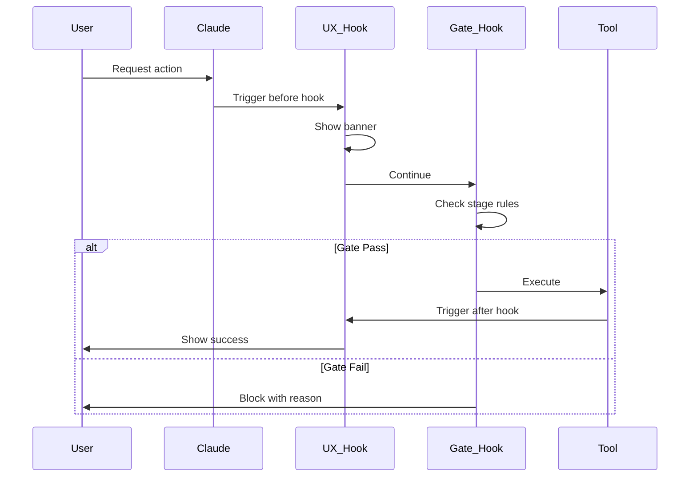

# ADR-002: Hook Integration Strategy

**Status:** Accepted
**Date:** 2025-08-07
**Deciders:** VeriFlowCC Architecture Team

## Context

Claude Code supports hooks that execute shell commands in response to events like tool calls. Agent-OS provides hook implementations that:
- Display colorful progress banners
- Block unauthorized tool usage based on current stage
- Provide user feedback during operations

VeriFlowCC needs to integrate these hooks while maintaining our own gate enforcement logic. We must resolve potential conflicts and establish clear precedence rules.

## Decision

We will implement a **merged hook architecture with clear precedence rules**:

1. **UX hooks run first** (priority 00-49) - Non-blocking, informational
2. **Gate enforcement hooks run second** (priority 50-99) - Blocking, security
3. **Cleanup hooks run last** (priority 100+) - Post-processing

### Hook Directory Structure

```bash
~/.claude/hooks/
├── before_edit.d/
│   ├── 05-agentos-banner.sh        # UX: Show edit banner
│   ├── 10-vv-gate-check.sh         # GATE: Check if editing allowed
│   └── 15-backup-file.sh           # UTIL: Backup before edit
├── after_edit.d/
│   ├── 05-agentos-success.sh       # UX: Show success message
│   └── 10-update-artifacts.sh      # UTIL: Track changes
├── before_bash.d/
│   ├── 05-agentos-command.sh       # UX: Display command
│   ├── 10-vv-gate-check.sh         # GATE: Check if bash allowed
│   └── 15-sandbox-check.sh         # SECURITY: Validate command
└── after_bash.d/
    ├── 05-agentos-result.sh        # UX: Show result summary
    └── 10-log-command.sh           # AUDIT: Log for review
```

## Rationale

### Why Merge Instead of Replace?

1. **Best User Experience**
   - Agent-OS provides polished UI feedback
   - Our gates provide safety and control
   - Combined approach gives both benefits

2. **Maintainability**
   - Separate concerns (UX vs Control)
   - Easy to update either independently
   - Clear debugging when issues arise

3. **Flexibility**
   - Can disable categories if needed
   - Easy to add new hooks
   - Simple precedence override

### Alternative Approaches Considered

**Replace Agent-OS Hooks Entirely**
- Pros: Full control, no conflicts
- Cons: Lose UX improvements, duplicate effort
- Rejected: Wasteful to recreate good UX

**Use Agent-OS Hooks As-Is**
- Pros: No integration work
- Cons: No gate enforcement, wrong stage model
- Rejected: Doesn't meet our V-Model requirements

**Conditional Loading**
- Pros: Switch between modes
- Cons: Complex configuration, confusing behavior
- Rejected: Too complicated for users

## Implementation

### Hook Template Structure

```bash
#!/bin/bash
# 10-vv-gate-check.sh - Gate enforcement hook

# Load state and configuration
STATE_FILE="${VV_STATE_FILE:-$HOME/.vv/state.json}"
STAGE=$(jq -r '.current_stage' "$STATE_FILE" 2>/dev/null || echo "unknown")

# Define allowed operations per stage
declare -A ALLOWED_OPS
ALLOWED_OPS["planning"]="read"
ALLOWED_OPS["requirements"]="read"
ALLOWED_OPS["design"]="read"
ALLOWED_OPS["coding"]="read write edit"
ALLOWED_OPS["testing"]="read bash test"
ALLOWED_OPS["validation"]="read"

# Check if operation is allowed
OPERATION="${1:-$CLAUDE_HOOK_OPERATION}"
if [[ ! " ${ALLOWED_OPS[$STAGE]} " =~ " ${OPERATION} " ]]; then
    echo "❌ Operation '$OPERATION' not allowed in stage '$STAGE'" >&2
    echo "   Allowed operations: ${ALLOWED_OPS[$STAGE]}" >&2
    exit 1
fi

# Log the check
echo "✅ Gate check passed: $OPERATION in $STAGE" >&2
```

### Hook Configuration

```yaml
# ~/.claude/hooks/config.yaml
hooks:
  enabled: true
  categories:
    ux:
      enabled: true
      priority_range: [0, 49]
      source: agent-os
    gate:
      enabled: true
      priority_range: [50, 99]
      source: verifflowcc
    utility:
      enabled: true
      priority_range: [100, 199]
      source: both

  overrides:
    # Specific hook overrides
    before_edit.d/10-vv-gate-check.sh:
      enabled: true
      continue_on_failure: false
      timeout: 5

  environment:
    VV_STATE_FILE: ~/.vv/state.json
    VV_HOOK_LOG: ~/.vv/logs/hooks.log
    VV_STRICT_MODE: true
```

### Gate Rules by Stage

| Stage | Allowed Tools | Blocked Tools | Rationale |
|-------|--------------|---------------|-----------|
| Planning | Read, Search | Edit, Write, Bash | Planning is read-only analysis |
| Requirements | Read, Search | Edit, Write, Bash | Requirements gathering only |
| Design | Read, Search | Edit, Write, Bash | Design is documentation |
| Coding | All | None | Implementation needs all tools |
| Testing | Read, Bash, Test | Edit, Write | No code changes during test |
| Validation | Read | Edit, Write, Bash | Final review only |

### Hook Execution Flow



## Consequences

### Positive

1. **Enhanced User Experience**
   - Colorful banners and progress indicators
   - Clear feedback on operations
   - Better error messages

2. **Strong Safety Guarantees**
   - Stage-appropriate tool access
   - Prevents accidental progression
   - Audit trail of attempts

3. **Maintainable Architecture**
   - Clear separation of concerns
   - Easy to debug issues
   - Simple to extend

### Negative

1. **Performance Overhead**
   - Multiple hook executions per operation
   - Slight latency increase (50-100ms)
   - More processes spawned

2. **Complexity**
   - More files to manage
   - Potential for hook conflicts
   - Debugging requires understanding both systems

3. **Dependency Management**
   - Requires jq for JSON parsing
   - Needs proper shell environment
   - Must maintain compatibility

## Mitigations

1. **Performance**: Cache state reads, use lightweight scripts
2. **Complexity**: Comprehensive logging, clear documentation
3. **Dependencies**: Bundle required tools, check at startup

## Testing Strategy

```bash
# Test hook integration
./scripts/test-hooks.sh

# Test cases:
# 1. UX hooks display correctly
# 2. Gates block inappropriate operations
# 3. Precedence order is respected
# 4. Failures are handled gracefully
# 5. Performance is acceptable (<100ms overhead)
```

## Migration Path

1. **Phase 1**: Install hooks without enforcement (logging only)
2. **Phase 2**: Enable enforcement in development
3. **Phase 3**: Roll out to production with override capability
4. **Phase 4**: Full enforcement as default

## References

- Claude Code Hook Documentation
- Agent-OS Hook Implementation
- Shell Script Best Practices
- Git Hooks for comparison

## Notes

This decision should be reviewed if:
- Claude Code changes hook architecture
- Performance becomes unacceptable (>500ms overhead)
- We need more complex rule evaluation
- We move away from shell-based hooks
